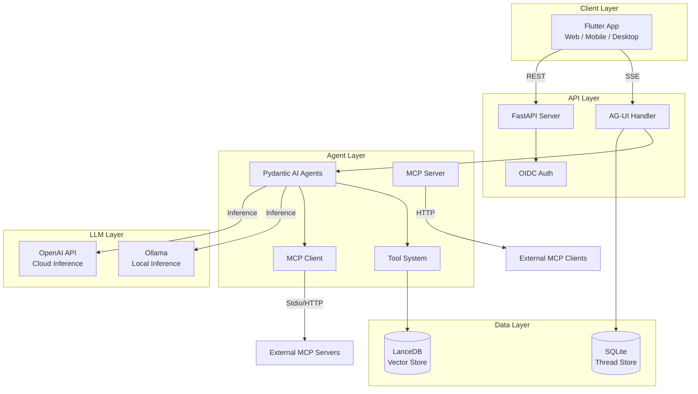
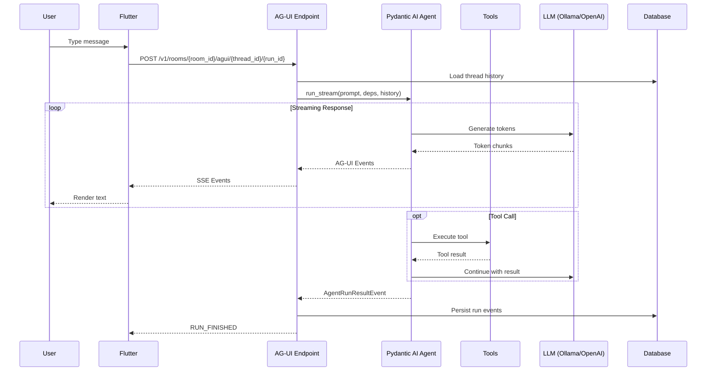
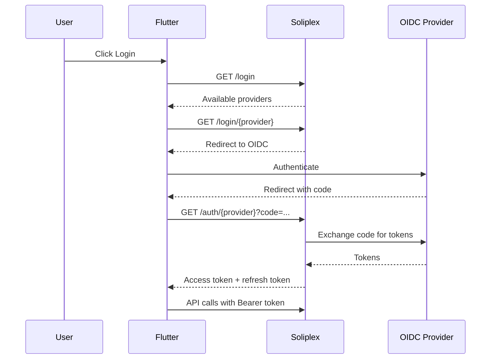
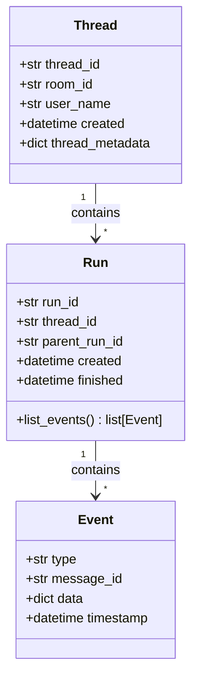
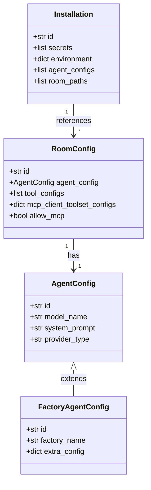
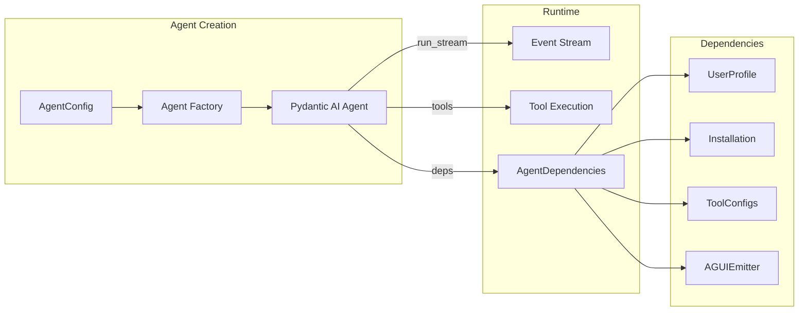
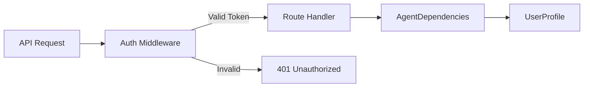
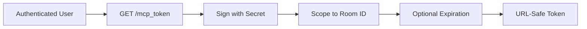
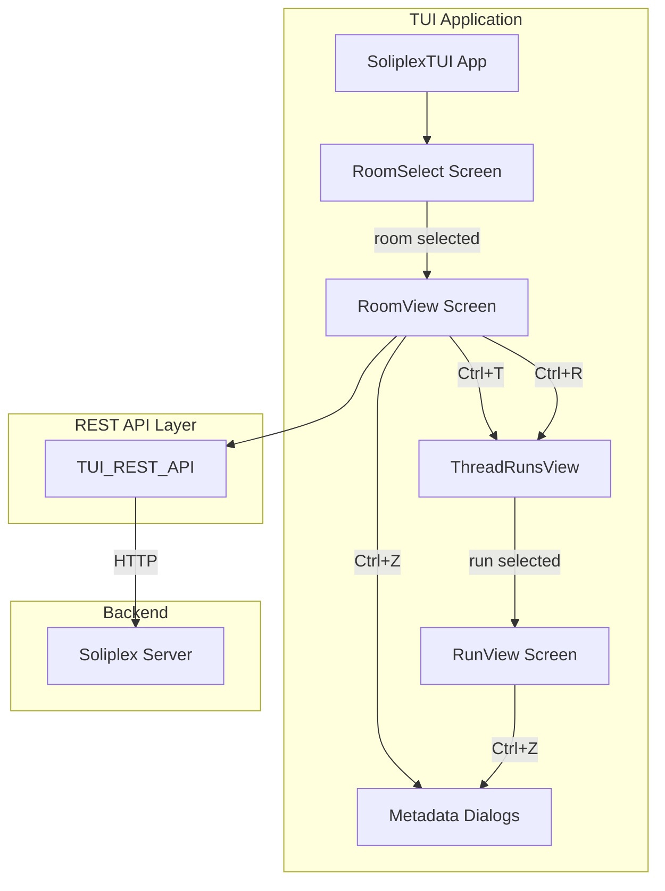

# Architecture

This document provides a comprehensive overview of Soliplex's architecture, component interactions, and data flows.

## System Overview

Soliplex is a multi-component AI platform with three main layers:



## Component Details

### Frontend (Flutter)

!!! note "Separate Repository"
    The Flutter frontend is maintained at [github.com/soliplex/flutter](https://github.com/soliplex/flutter).

| Component | Technology | Purpose |
|-----------|------------|---------|
| **UI Framework** | Flutter 3.x | Cross-platform rendering |
| **State Management** | Riverpod | Reactive state handling |
| **HTTP Client** | http | REST API calls |
| **SSE Client** | Custom | AG-UI streaming |

### Backend (Python)

| Component | Technology | Purpose |
|-----------|------------|---------|
| **Web Framework** | FastAPI | Async REST API |
| **Agent Framework** | Pydantic AI | LLM orchestration |
| **Vector Store** | LanceDB | RAG embeddings |
| **MCP** | FastMCP | Tool protocol |
| **Observability** | Logfire | Logging/tracing |

## Request Flow

### Chat Message Flow



### Authentication Flow



## Data Models

### Thread/Run Hierarchy



### Configuration Hierarchy



## Component Interactions

### Agent System



### MCP Integration

```mermaid
graph TB
    subgraph "MCP Server Mode"
        Room[Room Config] -->|allow_mcp: true| MCP_S[MCP Server]
        MCP_S -->|exposes| RoomTools[Room Tools]
        ExtClient[External Client] -->|authenticated| MCP_S
    end

    subgraph "MCP Client Mode"
        Room -->|mcp_client_toolsets| MCP_C[MCP Client]
        MCP_C -->|stdio| Subprocess[npx/python]
        MCP_C -->|http| Remote[Remote Server]
        MCP_C -->|provides| ExtTools[External Tools]
    end

    subgraph "Agent"
        Agent[Pydantic AI Agent]
        Agent --> RoomTools
        Agent --> ExtTools
    end
```

## Scalability Considerations

### Stateless Backend

The FastAPI backend is stateless:

- Thread/run data persisted to SQLite (configurable)
- No in-memory session state
- Horizontal scaling possible with shared database

### Agent Caching

Agents are cached by ID to avoid recreation:

```python
_agent_cache: dict[str, Agent] = {}

def get_agent(config):
    if config.id not in _agent_cache:
        _agent_cache[config.id] = create_agent(config)
    return _agent_cache[config.id]
```

### Streaming Architecture

AG-UI uses Server-Sent Events for efficient streaming:

- Single HTTP connection per run
- Events compacted to reduce overhead
- Multiplexed streams for agent + emitter events

## Security Architecture

### Authentication



### MCP Token Security



## File Organization

```
src/soliplex/
├── __init__.py
├── agents.py          # Agent creation, caching
├── config.py          # Configuration parsing
├── installation.py    # Installation management
├── mcp_server.py      # MCP server
├── mcp_client.py      # MCP client
├── mcp_auth.py        # MCP authentication
├── models.py          # Pydantic models
├── tools.py           # Tool implementations
├── examples.py        # Factory agent examples
├── agui/              # AG-UI protocol
│   ├── __init__.py    # Core AG-UI types and utilities
│   ├── features.py    # Feature flags
│   ├── mpx.py         # Multiplexing utilities
│   ├── parser.py      # Event parsing
│   ├── persistence.py # Thread/run storage
│   └── util.py        # Helper functions
├── authz/             # Authorization
│   ├── __init__.py    # Authorization service
│   └── schema.py      # SQLAlchemy models
├── views/             # FastAPI routes
│   ├── agui.py        # AG-UI streaming
│   ├── auth.py        # Legacy auth
│   ├── authn.py       # Authentication
│   ├── authz.py       # Authorization endpoints
│   ├── completions.py # Completion configs
│   ├── installation.py # Installation info
│   ├── quizzes.py     # Quiz endpoints
│   └── rooms.py       # Room endpoints
└── tui/               # Terminal UI client
    ├── __init__.py
    ├── cli.py         # CLI entry point
    ├── main.py        # TUI app, screens, widgets
    ├── rest_api.py    # REST API client
    └── serve.py       # Web-serve wrapper
```

## TUI Architecture

The Terminal User Interface provides a Textual-based client for Soliplex.



### Key Components

| Component | File | Purpose |
|-----------|------|---------|
| `TUI_REST_API` | `rest_api.py` | HTTP client for backend communication |
| `SoliplexTUI` | `main.py` | Main app with room selection |
| `RoomView` | `main.py` | Chat interface with thread management |
| `RunView` | `main.py` | Detailed run event viewer |
| `EditThreadMetadataDialog` | `main.py` | Thread name/description editing |
| `EditRunMetadataDialog` | `main.py` | Run label editing |

### Screen Flow

1. **Room Selection** → User picks a room from available rooms
2. **Room Chat** → Chat interface with current thread
3. **Thread List** → Browse all threads via `Ctrl+T`
4. **Run List** → Browse runs in current thread via `Ctrl+R`
5. **Run Details** → View run events and messages

## Technology Decisions

| Decision | Choice | Rationale |
|----------|--------|-----------|
| **Agent Framework** | Pydantic AI | Type-safe, streaming support, tool integration |
| **Vector Store** | LanceDB | Embedded, fast, good Python support |
| **Streaming Protocol** | AG-UI over SSE | Rich event types, browser compatible |
| **MCP Implementation** | FastMCP | Official Python SDK, dual mode |
| **State Management** | Riverpod | Testable, scoped providers |
