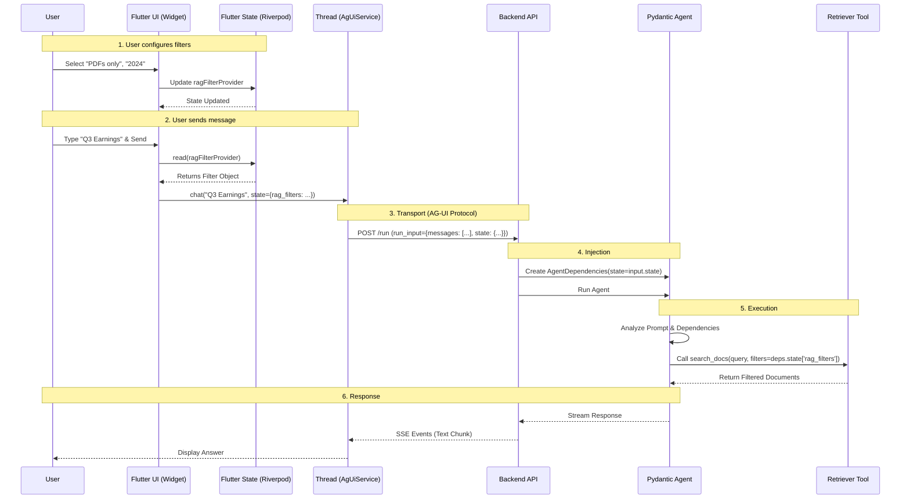

# Process: AG-UI Frontend-Backend Alignment

This document specifies the standard development process for adding new capabilities that require alignment between the Flutter frontend and the Python backend agent, using **RAG Query with Filtering** as the canonical example.

## 1. Schema Definition (The Contract)

Before writing logic, define the data contract. This ensures both sides agree on the "shape" of the data.

### 1.1. Create/Update Schema Specification
**Artifact:** `docs/specs/schemas/{capability_name}.md`

Define the JSON structure for the capability.
*   **Example:** `rag_filters`
*   **Location:** `docs/specs/schemas/rag_filters.md`

```json
{
  "rag_filters": {
    "file_types": ["pdf", "txt"],
    "date_range": {
      "start": "2024-01-01",
      "end": "2024-12-31"
    },
    "source_ids": ["source-123"]
  }
}
```

### 1.2. (Optional) Define Pydantic Model
**Artifact:** `src/soliplex/agui/schemas/{capability}.py`

For complex structures, strictly define it in Python to serve as the source of truth for generation or validation.

```python
class DateRange(BaseModel):
    start: str
    end: str

class RagFilters(BaseModel):
    file_types: list[str] = []
    date_range: DateRange | None = None
```

---

## 2. Backend Implementation

### 2.1. Update Agent Dependencies
**File:** `src/soliplex/agents.py`

Ensure the backend `AgentDependencies` can accept the new state slice.
*   *Note:* Currently `AgentDependencies.state` is a `dict`. No code change is needed if using raw dicts, but using the Pydantic model (Step 1.2) for validation is recommended.

### 2.2. Implement Tool Logic
**File:** `src/soliplex/tools/{capability}_tools.py`

The agent tool must extract and use the state.

```python
def search_docs(ctx: RunContext[AgentDependencies], query: str) -> str:
    # 1. Extract State
    filters_dict = ctx.deps.state.get("rag_filters", {})
    
    # 2. Validate (Defensive)
    # If the schema doesn't match, log warning and ignore or raise error?
    # DECISION: Ignore invalid filters to prevent crashing the chat.
    
    # 3. Execute
    return vector_store.search(query, filters=filters_dict)
```

### 2.3. Add Test Case
**File:** `tests/unit/test_agents.py`

Verify the tool correctly handles the injected state.
*   **Test:** Create a `AgentDependencies` with mock state, call the tool, assert the mock vector store received the filters.

---

## 3. Frontend Implementation

### 3.1. Create Data Model
**File:** `lib/infrastructure/agui/models/{capability}_state.dart`

Create a Dart class with `toJson` serialization matching the schema.

```dart
class RagFiltersState {
  final List<String> fileTypes;
  final DateRange? dateRange;
  
  Map<String, dynamic> toJson() => {
    'rag_filters': {
      'file_types': fileTypes,
      'date_range': dateRange?.toJson(),
    }
  };
}
```

### 3.2. Implement UI Widget
**File:** `lib/features/chat/widgets/{capability}_widget.dart`

Build the UI to manipulate this state.
*   **State Management:** Use a `StateProvider` or `NotifierProvider`.
    ```dart
    final ragFilterProvider = StateProvider<RagFiltersState>((ref) => RagFiltersState());
    ```

### 3.3. Inject State into Chat
**File:** `lib/features/chat/chat_view_model.dart` (or `chat_content.dart`)

Modify the `send` logic to include this provider's state.

```dart
Future<void> sendMessage(String text) async {
  final filters = ref.read(ragFilterProvider);
  final canvas = ref.read(canvasProvider);
  
  // Merge states
  final combinedState = {
    ...filters.toJson(), // adds "rag_filters": {...}
    ...canvas.toJson(),  // adds "canvas": [...]
  };
  
  await agUiService.chat(text, state: combinedState);
}
```

---

## 4. Verification & QA

### 4.1. Integration Test (Manual)
1.  **Start Backend:** `uv run src/soliplex/main.py`
2.  **Start Frontend:** `flutter run -d macos`
3.  **Configure:** Open the "Filters" widget, select "PDF only".
4.  **Chat:** Ask "Summarize the report".
5.  **Verify Backend Logs:** Check `DebugLog` or backend console.
    *   *Expected:* `AG-UI request: state={ "rag_filters": { "file_types": ["pdf"] } ... }`
    *   *Expected:* Tool execution log shows `filters={'file_types': ['pdf']}`.

### 4.2. Failure Mode Analysis
*   **What if Backend doesn't support the key?**
    *   Backend simply ignores the extra key in `state`. Safe.
*   **What if Frontend sends malformed data (e.g., string instead of list)?**
    *   Backend tool should catch `TypeError` and fallback to default (no filter).

---

## 5. Lifecycle Integration

This process hooks into `docs/PROCESS.md`:

1.  **Spec Phase:** Create `docs/specs/schemas/{capability}.md`.
2.  **Work Log:** Track implementation in `docs/work-logs/{feature}.md`.
3.  **Completion:** Update `APP_FEATURES.md` marking the capability as supported.

## Summary Checklist

- [ ] **Contract:** JSON Schema defined?
- [ ] **Backend:** Tool logic reads `ctx.deps.state`?
- [ ] **Frontend Model:** `toJson()` matches schema?
- [ ] **Frontend UI:** Provider injected into `agUiService.chat()`?
- [ ] **Verification:** Confirmed state transmission in logs?

## 6. Walkthrough

This section visualizes the complete lifecycle of a "Filtered RAG Query" to demonstrate how the **State** travels separately from but alongside the **Message**.

### 6.1. Sequence Diagram



### 6.2. Detailed State Flow

1.  **Configuration (Client-Side Only):**
    The user interacts with the **UI Widget**. This updates the **Flutter State** (Riverpod). The backend is *unaware* of this activity.
    *   *State:* `{ "rag_filters": { "file_types": ["pdf"] } }` (Local Memory)

2.  **Snapshotting:**
    When the user sends a message, the **AgUiService** takes a snapshot of the current Flutter State. It serializes the object to JSON.

3.  **Transmission:**
    The JSON blob is attached to the `state` field of the HTTP POST request. It travels "sidecar" to the message content.
    *   *Payload:* `{"messages": [...], "state": {"rag_filters": ...}}`

4.  **Injection:**
    The Backend receives the payload. The `AGUIAdapter` extracts the `state` dict and places it into the `AgentDependencies` dataclass.

5.  **Consumption:**
    The Agent's System Prompt or Tool Logic accesses `ctx.deps.state`.
    *   *Code:* `filters = ctx.deps.state['rag_filters']`
    *   The tool executes *using* these filters effectively applying the user's intent to the retrieval process.

