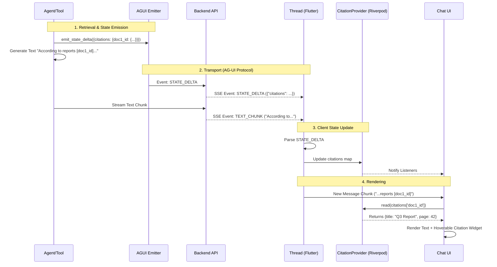

# Use Case: RAG Response with Citations

**Goal:** The Agent provides citations for its claims, which are structured data (not just text) that the Frontend can render interactively (e.g., hoverable links to source documents).

**Actors:**
*   **User:** Reads the response.
*   **Backend (Python):** Retrieves documents and generates the response + citation data.
*   **Frontend (Flutter):** Renders the text and "decorates" it with citation widgets.

## Interaction Steps

1.  **Agent Retrieval (Backend)**
    *   The Agent queries the vector database and retrieves chunks (e.g., `Chunk A` from `doc1.pdf`, `Chunk B` from `doc2.txt`).
    *   Each chunk has metadata (source ID, page number, confidence score).

2.  **Response Generation (Backend)**
    *   The Agent generates the text answer.
    *   **Crucial Step:** As the Agent cites a source, it needs to send the *structured metadata* of that source to the client, so the client knows what "[1]" refers to.

3.  **State Update (Backend -> Frontend)**
    *   **Mechanism:** The Agent (or the tool it called) emits a `STATE_DELTA` (or `STATE_SNAPSHOT` update) containing the citation details.
    *   **Payload (Event):**
        ```json
        {
          "type": "state_delta",
          "delta": {
            "citations": {
              "doc1_id": { "title": "Q3 Report", "url": "...", "page": 42 },
              "doc2_id": { "title": "Meeting Notes", "url": "...", "author": "Alice" }
            }
          }
        }
        ```
    *   *Alternative:* The citations could be a list appended to `rag_citations`.

4.  **UI Rendering (Frontend)**
    *   The Frontend receives the `STATE_DELTA`.
    *   It updates its local `CitationState` store.
    *   **Text Parsing:** The text message arrives (e.g., "The profit was high [1].").
    *   **Correlation:** The UI matches the reference marker `[1]` (which might map to `doc1_id`) with the data in `CitationState`.
    *   **Display:** The UI renders a tooltip or sidebar item showing "Q3 Report, Page 42".

## Contract Requirements
*   **State Key:** `citations` (or similar).
*   **Direction:** Backend -> Frontend (unlike filtering which was Frontend -> Backend).
*   **Synchronization:** The text stream (containing the reference markers like `[1]`) and the state stream (containing the metadata for `[1]`) must arrive roughly in sync for the best UX, though eventual consistency is acceptable (the tooltip might appear a split second after the text).
*   **Additivity:** Citations usually *accumulate*. The backend should send *new* citations as they are found, or the full list if simpler. The `STATE_DELTA` mechanism supports merging, which is ideal here.

## 5. Walkthrough

This section visualizes the lifecycle of a "Cited Response" to demonstrate how **State** flows from the Backend to the Client, enhancing the text stream.

### 5.1. Sequence Diagram



### 5.2. Detailed State Flow

1.  **Emission (Backend Side):**
    The Agent (or specifically the Retrieval Tool) finds relevant documents.
    *   **Action:** It calls `ctx.deps.agui_emitter.emit_state_delta(...)`.
    *   **Payload:** `{"citations": {"doc1_id": {"title": "Q3 Report", "url": "..."}}}`
    *   *Timing:* This usually happens *before* or *during* text generation.

2.  **Transmission:**
    The `AGUIAdapter` and multiplexer stream this event to the client.
    *   It travels alongside `TEXT_MESSAGE_CHUNK` events.

3.  **Consumption (Frontend Side):**
    The Flutter `Thread` class receives `StateDeltaEvent`.
    *   **Logic:** It merges the delta into the current `State` object.
    *   `currentState['citations']['doc1_id']` is now available.

4.  **Reactive Update:**
    The Riverpod `CitationProvider` (watching the thread state) updates.
    *   The UI rebuilds. The text parser identifies `[doc1_id]`, resolves it to the citation object, and checks the provider.
    *   Since the data arrived via the Delta, the UI can immediately render the rich citation tooltip instead of just plain text.

