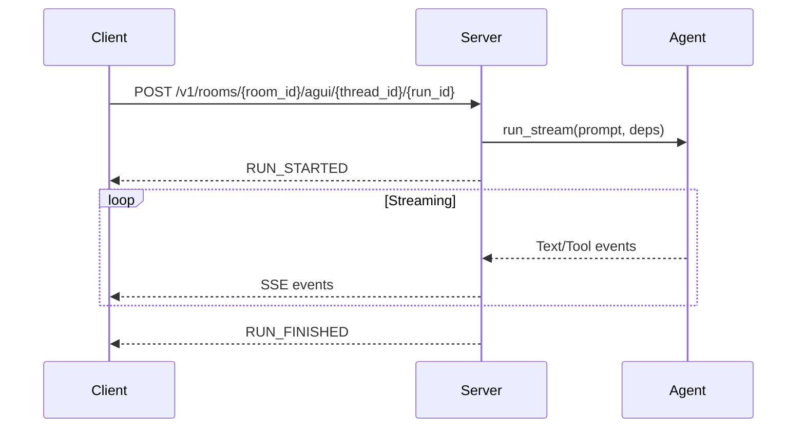

# AG-UI Protocol

Soliplex implements the AG-UI (Agent-User Interface) protocol for streaming AI responses to clients.

## Overview

AG-UI is a protocol for real-time agent-to-UI communication over Server-Sent Events (SSE).

```
Flutter Client ←→ SSE Stream ←→ AG-UI Adapter ←→ Pydantic AI Agent
```

## Event Flow



## Event Types

### Run Lifecycle Events

**RUN_STARTED**
```json
{
  "type": "RUN_STARTED",
  "run_id": "run-123",
  "thread_id": "thread-456"
}
```

**RUN_FINISHED**
```json
{
  "type": "RUN_FINISHED"
}
```

**RUN_ERROR**
```json
{
  "type": "RUN_ERROR",
  "error": "Connection timeout"
}
```

### Text Message Events

**TEXT_MESSAGE_START**
```json
{
  "type": "TEXT_MESSAGE_START",
  "message_id": "msg-1",
  "role": "assistant"
}
```

**TEXT_MESSAGE_CONTENT**
```json
{
  "type": "TEXT_MESSAGE_CONTENT",
  "message_id": "msg-1",
  "delta": "Hello, "
}
```

**TEXT_MESSAGE_END**
```json
{
  "type": "TEXT_MESSAGE_END",
  "message_id": "msg-1"
}
```

### Tool Call Events

**TOOL_CALL_START**
```json
{
  "type": "TOOL_CALL_START",
  "tool_call_id": "tc-1",
  "tool_name": "search_documents"
}
```

**TOOL_CALL_ARGS**
```json
{
  "type": "TOOL_CALL_ARGS",
  "tool_call_id": "tc-1",
  "delta": "{\"query\": \"RAG\"}"
}
```

**TOOL_CALL_END**
```json
{
  "type": "TOOL_CALL_END",
  "tool_call_id": "tc-1"
}
```

**TOOL_CALL_RESULT**
```json
{
  "type": "TOOL_CALL_RESULT",
  "tool_call_id": "tc-1",
  "result": "[{\"content\": \"...\"}]"
}
```

### State Events

**STATE_SNAPSHOT**
```json
{
  "type": "STATE_SNAPSHOT",
  "snapshot": {
    "filter_documents": null,
    "ask_history": null
  }
}
```

**STATE_DELTA**
```json
{
  "type": "STATE_DELTA",
  "delta": [
    {"op": "replace", "path": "/ask_history", "value": {"questions": [...]}}
  ]
}
```

### Custom Events

**CUSTOM**
```json
{
  "type": "CUSTOM",
  "name": "RESEARCH_PROGRESS",
  "data": {
    "step": "Searching documents..."
  }
}
```

## SSE Format

Events are transmitted as Server-Sent Events:

```
event: TEXT_MESSAGE_START
data: {"type": "TEXT_MESSAGE_START", "message_id": "msg-1"}

event: TEXT_MESSAGE_CONTENT
data: {"type": "TEXT_MESSAGE_CONTENT", "delta": "Hello, "}

event: TEXT_MESSAGE_CONTENT
data: {"type": "TEXT_MESSAGE_CONTENT", "delta": "world!"}

event: TEXT_MESSAGE_END
data: {"type": "TEXT_MESSAGE_END"}
```

The `event` field matches the event type, and `data` contains the JSON payload.

## Request Format

### RunAgentInput

The request body for executing a run:

```json
{
  "messages": [
    {
      "role": "user",
      "content": "What is RAG?"
    }
  ],
  "state": {
    "filter_documents": {
      "document_ids": ["doc-1", "doc-2"]
    }
  },
  "context": []
}
```

**Fields:**
- `messages` - Conversation history
- `state` - Shared state accessible to tools
- `context` - Additional context items

## Server Implementation

### AG-UI Adapter

The server uses Pydantic AI's AG-UI adapter:

```python
from pydantic_ai.ui import ag_ui as ai_ag_ui

agui_adapter = await ai_ag_ui.AGUIAdapter.from_request(
    request=request,
    agent=agent,
)

agent_stream = agui_adapter.run_stream(
    deps=agent_deps,
    on_complete=finish_callback,
)

sse_stream = agui_adapter.encode_stream(agent_stream)
return StreamingResponse(sse_stream, media_type="text/event-stream")
```

### Event Compaction

Consecutive text events are compacted to reduce overhead:

```python
from soliplex.agui import compact_event_stream

# Before: Many small TEXT_MESSAGE_CONTENT events
# After: Fewer, larger TEXT_MESSAGE_CONTENT events
compacted = compact_event_stream(agent_stream)
```

### Stream Multiplexing

Agent events can be combined with custom emitter events:

```python
from soliplex.agui.mpx import multiplex_streams
from soliplex.agui.parser import agui_events_from_dicts

emitter_stream = agui_events_from_dicts(emitter)
combined = multiplex_streams(agent_stream, emitter_stream)
```

### Event Persistence

Events are persisted to the database for replay:

```python
async def tee_events(event_stream, event_list, on_done):
    async for event in event_stream:
        event_list.append(event)
        yield event
    await on_done(events=event_list)
```

## Client Implementation

### Dart/Flutter

```dart
import 'dart:convert';
import 'package:http/http.dart' as http;

Future<void> executeRun(String threadId, String runId, String message) async {
  final request = http.Request(
    'POST',
    Uri.parse('$baseUrl/v1/rooms/$roomId/agui/$threadId/$runId'),
  );

  request.body = jsonEncode({
    'messages': [{'role': 'user', 'content': message}],
    'state': {},
  });

  request.headers['Authorization'] = 'Bearer $token';
  request.headers['Accept'] = 'text/event-stream';

  final response = await http.Client().send(request);

  await for (final chunk in response.stream.transform(utf8.decoder)) {
    for (final line in chunk.split('\n')) {
      if (line.startsWith('data: ')) {
        final data = jsonDecode(line.substring(6));
        handleEvent(data);
      }
    }
  }
}

void handleEvent(Map<String, dynamic> event) {
  switch (event['type']) {
    case 'TEXT_MESSAGE_START':
      startNewMessage(event['message_id']);
      break;
    case 'TEXT_MESSAGE_CONTENT':
      appendContent(event['delta']);
      break;
    case 'TEXT_MESSAGE_END':
      finalizeMessage();
      break;
    case 'TOOL_CALL_START':
      showToolCall(event['tool_name']);
      break;
    case 'TOOL_CALL_RESULT':
      showToolResult(event['result']);
      break;
    case 'RUN_FINISHED':
      completeRun();
      break;
    case 'RUN_ERROR':
      showError(event['error']);
      break;
  }
}
```

## Thread and Run Model

### Thread

A thread represents a conversation session:

```json
{
  "thread_id": "thread-123",
  "room_id": "research",
  "created": "2024-01-15T10:30:00Z",
  "metadata": {
    "name": "Research session",
    "description": null
  }
}
```

### Run

A run represents a single agent execution within a thread:

```json
{
  "run_id": "run-1",
  "thread_id": "thread-123",
  "parent_run_id": null,
  "created": "2024-01-15T10:30:00Z",
  "finished": null,
  "run_input": {
    "messages": [...]
  },
  "events": [...]
}
```

Runs can be nested (via `parent_run_id`) for multi-turn conversations.

## State Management

State is shared between client and server:

1. Client sends initial state in `RunAgentInput.state`
2. Tools can read state via `ctx.deps.state`
3. Tools update state via `agui_emitter.update_state()`
4. Server sends `STATE_DELTA` events to client
5. Client updates local state

This enables features like document filtering and citation tracking.

## Source Code

- AG-UI endpoint: `src/soliplex/views/agui.py`
- AG-UI package: `src/soliplex/agui/`
- Event compaction: `src/soliplex/agui/__init__.py`
- Event parsing: `src/soliplex/agui/parser.py`
- Stream multiplexing: `src/soliplex/agui/mpx.py`
